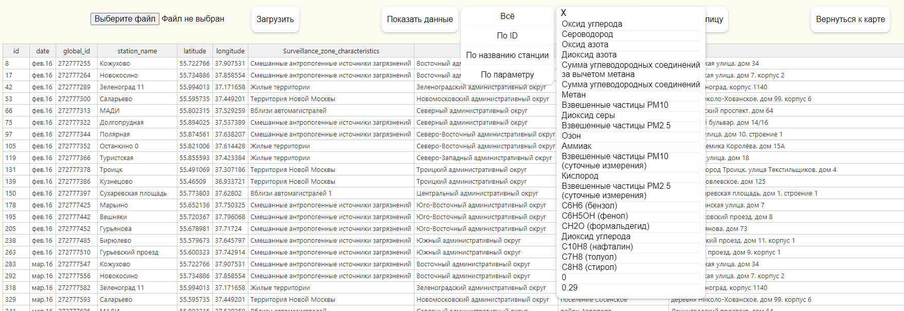
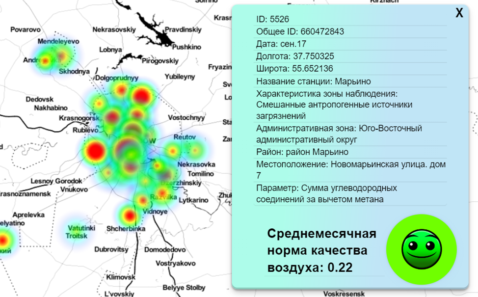

## Учебный проект по визуализации индекса качества воздуха в районах Москвы.

### Цель проекта
Целью данного проекта является создание веб-сайта с интерактивной картой, на которой будет отображаться индекс качества воздуха(AQI) в районах Москвы. Данные для карты будут загружаться из CSV-файла, который будет обновляться администратором сайта. Пользователи сайта смогут просматривать данные о качестве воздуха в интересующих их районах.

### Описание проекта
Проект будет реализован на основе следующих технологий:
+ REST API как основной архитектурный стиль приложения
+ чистый javascript
+ OpenLayers API - Библиотека для отрисовки векторных данных и маркеров на карте
+ Handsontable - Компонент электронных таблиц JavaScript
+ Spring boot
+ PostgreSQL

### Основные функциональности
+ Загрузка и возможность редактирования таблицы  данных на странице администратора.

+ Интерактивная карта: Веб-сайт предоставляет пользователю интерактивную карту мира, на которой отображаются отрисованные области распространения вредных веществ за выбранную дату. 
+ Информационные окна: Пользователь может кликнуть по конкретной точке на карте, чтобы получить более подробную информацию о текущем состоянии воздуха в выбранной локации.
 
